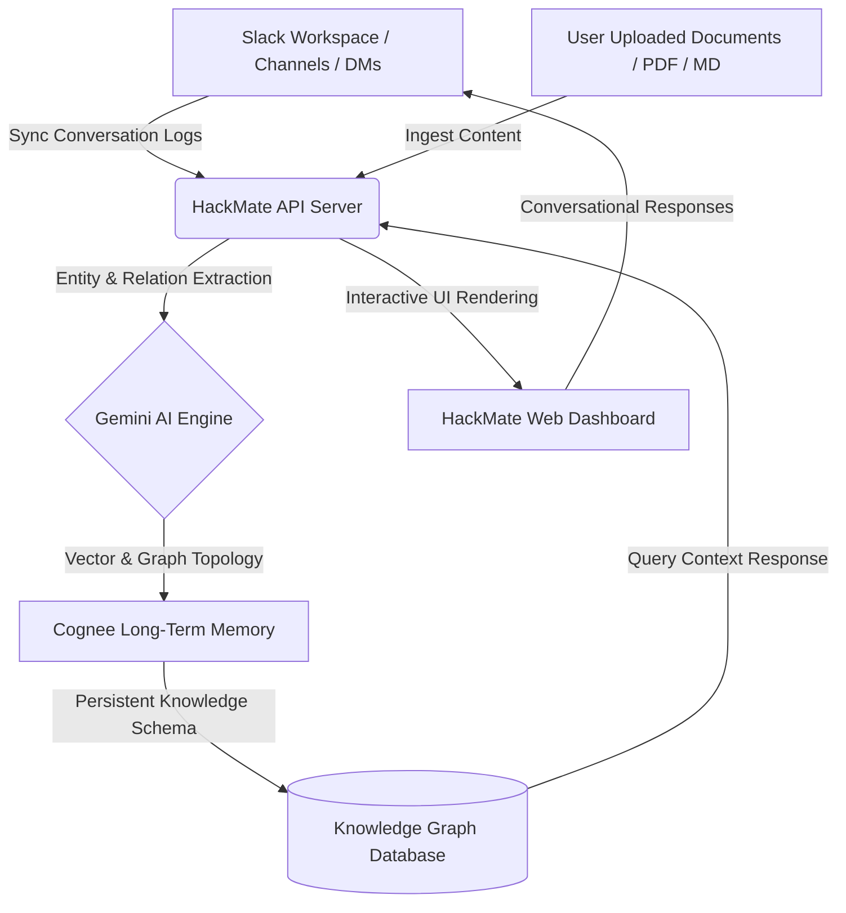

# 🤖 HackMate AI

> **"The AI teammate that never forgets."**

[](https://react.dev/)
[](https://nextjs.org/)
[](https://tailwindcss.com/)
[](https://api.slack.com/)
[](https://www.cognee.ai/)
[](https://ai.google.dev/)
[](https://fastapi.tiangolo.com/)

---

## 📌 Problem Statement

In fast-paced environments like hackathons, high-velocity startups, and remote development squads, team collaboration suffers from **context fragmentation**:
* **Lost Conversations:** Crucial decisions, ideas, and tasks get buried within hundreds of daily Slack messages.
* **Knowledge Decay:** Teammates frequently ask redundant questions because project goals, files, and updates are scattered across different platforms.
* **Amnesia in AI Assistants:** Conventional AI assistants have strict context limits, meaning they forget previous chats, critical parameters, and previous decisions.

---

## 💡 Solution

**HackMate AI** is your persistent, long-term AI-powered virtual teammate that integrates directly with Slack and a centralized dashboard. Powered by **Gemini AI** and **Cognee Long-Term Memory (Knowledge Graph)**, HackMate monitors workspace chat, extracts actionable decisions, constructs semantic knowledge structures, analyzes uploaded project documents, and maintains an unshakeable, contextual memory. 

No more scrollback fatigue. HackMate remembers your architecture, your files, your active tasks, and who is working on what—delivering context on demand.

---

## ✨ Key Features

* **🔌 Slack Integration:** Active channel monitoring and instant Slack DM triggers. Synchronizes conversations, file attachments, and user activities into the central project hub.
* **🧠 Cognee Persistent Memory & Knowledge Graph:** Constructs an active semantic graph of your project topics, technologies, and milestones so HackMate always retains long-term conceptual context.
* **💬 Conversational AI Chat with Context:** Ask HackMate about your project history, requirements, or dependencies with deep recall of historical channel chats.
* **📄 AI Document Review:** Upload hackathon prompt briefs, API specifications, or design schemas. HackMate ingests, reviews, and synthesizes key requirements.
* **📋 Task Board & Deadline Timelines:** Visual progress dashboard featuring smart task assignments, priority boards, and dynamic countdowns.
* **💡 Smart Decision Tracking:** Auto-extracts "key design decisions" from Slack discussions to establish an immutable log of "Why, When, and Who".
* **👥 Team Collaboration Hub:** View team members, assign skill sets, and inspect team workload density.
* **📊 Visual Memory Graph Explorer:** An interactive 3D/2D node-link visualizer rendering Cognee's cognitive graph representing your workspace topics, entities, and relationships.
* **📰 AI Daily Summaries:** Automated high-level executive summaries generated daily to keep asynchronous teammates on the exact same page.

---

## 🛠️ Architecture

The following diagram illustrates how conversation flows and knowledge is synthesized within HackMate AI:



---

## 📸 Screenshots

### 🖥️ Dashboard View
*The main nerve center displaying team workload, persistent summaries, urgent milestones, and recent activity.*
> `[ Placeholder: Insert Dashboard Screenshot Here ]`

### 💬 Slack Integration Hub
*Configuring webhook channels, setting up listener bots, and mapping team aliases.*
> `[ Placeholder: Insert Slack Integration Screenshot Here ]`

### 🧠 Interactive AI Chat
*Conversing with your context-aware virtual teammate, retrieving documents, and querying old channels.*
> `[ Placeholder: Insert AI Chat Screenshot Here ]`

### 📄 Documents AI Panel
*Where hackathon briefs, PDF specifications, and schemas undergo comprehensive structural review.*
> `[ Placeholder: Insert Documents Review Screenshot Here ]`

### 🕸️ Visual Memory Graph Explorer
*A majestic, interactive node network demonstrating how project concepts, tasks, and users link together.*
> `[ Placeholder: Insert Memory Graph Screenshot Here ]`

### 📋 Tasks Board & Timeline
*A fully-featured kanban workflow indicating task categories, owner assignments, and pending deadlines.*
> `[ Placeholder: Insert Tasks Board Screenshot Here ]`

---

## 💻 Tech Stack

### Frontend
* **Core:** React 18+ (TypeScript), Vite
* **Animations:** Motion (Framer Motion)
* **Icons:** Lucide React
* **Styling:** Tailwind CSS (Modern `@import` layout)

### Backend
* **Core Engine:** Node.js Express (custom TypeScript pipeline with Vite development middlewares)
* **External APIs:** FastAPI / Python Flask wrappers (for heavy AI data preparation)

### Database & Storage
* **Local Hub:** SQLite / Local file-based mock databases (`db.json`) for zero-configuration startup and light storage.

### AI & Cognitive Memory
* **Language Model:** Google Gemini API (`@google/genai` TypeScript SDK)
* **Memory & Graph:** Cognee Long-Term Memory (Topology mapping, vector indexing, and structural entity linking)

---

## 🚀 Installation & Setup

Follow these instructions to spin up the development workspace locally:

### Prerequisites
* **Node.js** (v18.x or higher)
* **npm** (v9.x or higher)

### 1. Clone the Repository
```bash
git clone https://github.com/sanskriti45-tech/HackMate-AI-The-AI-Hackathon-Teammate-with-Long-Term-Memory.git
cd HackMate-AI-The-AI-Hackathon-Teammate-with-Long-Term-Memory
```

### 2. Install Project Dependencies
```bash
npm install
```

### 3. Setup Environment Variables
Create a `.env` file in the root directory:
```bash
cp .env.example .env
```

Configure your credentials inside `.env` as defined in the **Environment Variables** section.

### 4. Start the Application
Boot both the custom Express server and the Vite React frontend concurrently:
```bash
npm run dev
```

The application will now be running at: **`http://localhost:3000`**

---

## 🔑 Environment Variables

The application requires the following environment configurations to connect external models and integrations:

| Variable | Description | Required / Optional |
| :--- | :--- | :--- |
| `GEMINI_API_KEY` | Google GenAI API key used for conversation summary, chat, and document extraction. | **Required** (Server-side) |
| `COGNEE_API_KEY` | API Key for accessing Cognee's hosted cognitive graph services (if using cloud). | Optional (Defaults to local) |
| `SLACK_SIGNING_SECRET` | Secret hash to verify incoming webhooks directly from the Slack API events router. | Optional (For live slack webhook events) |
| `SLACK_BOT_TOKEN` | Bot OAuth Token (`xoxb-...`) to post messages back to channels and user direct messages. | Optional (For postback action channels) |

---

## 💡 Usage Guide

### 1. Connect to your Slack Channel
Navigate to the **Slack** view within the dashboard. Enter your webhook credentials or trigger simulated channel feeds to test pipeline performance without deployment overhead.

### 2. Ingest Project Documentation
Head to the **Documents** panel, drag-and-drop your project briefs or design drafts. The AI will immediately parse requirements and index the document structure directly into Cognee's semantic memory.

### 3. Interact with Chat
Ask natural questions like:
> *"What did Sanskriti say about the database choice yesterday?"*
> *"Which tasks are blocking our milestone on Sunday?"*

### 4. Traverse the Knowledge Graph
Open the **Memory Graph** visualizer. Drag nodes, expand relationships, and inspect how files, concepts, tasks, and users form a connected web of project context.

---

## 📽️ Demo Video
Watch HackMate AI in action, from channel sync to memory traversal:
> `[ Placeholder: Insert Demo Video URL/GIF Here ]`

---

## 🛣️ Future Roadmap

* [ ] **Live Slack App Directory Launch:** Simplified single-click Slack app authorization.
* [ ] **Voice Summaries:** Integration with real-time TTS/STT channels for voice briefings.
* [ ] **Google Workspace Sync:** Direct ingestion of Google Docs, Slides, and Sheets into Cognee structures.
* [ ] **Automatic PR Review:** An automated agent analyzing GitHub Pull Request code changes against the Slack discussion history.

---

## 👥 Contributors

* **Sanskriti Maheshwari** - Lead Engineer, UX Designer & AI Architect

---

## 📄 License

This project is licensed under the MIT License - see the [LICENSE](LICENSE) file for details.

---

## ❤️ Acknowledgements

* Built for the **Google Cloud AI Hackathon** series.
* Huge thanks to the **Cognee.ai** team for their groundbreaking local cognitive mapping and graph technology.
* Powered by Google's incredibly fast, high-context **Gemini Flash** model.
